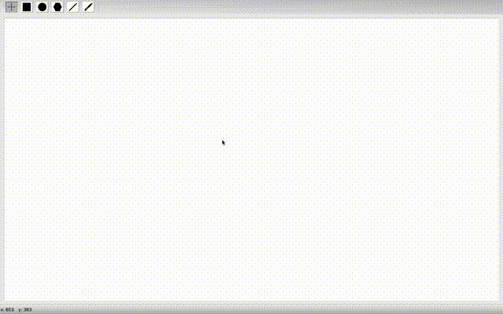
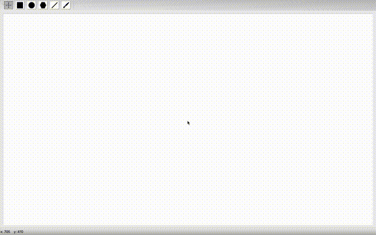
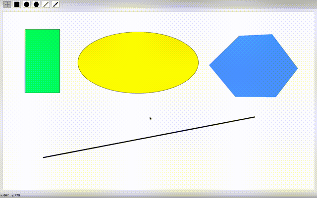

# Painter GUI Application via C++ Qt Framework

### A drawing application created with the aim of mastering a wide range of features of the Qt framework.

#### At the moment, the application supports the following functionality:

- Shape modification mode
- Rectangle creation mode
- Ellipse creation mode
- Polygon creation mode
- Mode for creating straight lines
- Brush drawing mode
- Ability to choose the fill color
- Ability to choose the stroke color
- Ability to select the stroke width

#### Rules defined for creating geometric shapes:

- **Rectangle**: when the left mouse button is pressed, the vertex of one of the corners of the rectangle is determined, when moving with the left mouse button held down, the diagonal vertex of the corner of the rectangle is determined. The rectangle assumes its final state after releasing the left mouse button. When the _"Shift"_ button is pressed, a square is drawn, one of the vertices of which is the point with the coordinates of the first click of the left mouse button, the length of the side of the square is determined to be equal to the length of the smaller of the two straight segments formed from the current cursor position to the X and Y axes.

  

- **Polygon**: A polygon is created according to the coordinates defined by successive left mouse clicks. The last coordinate is determined by right-clicking. Between clicks, a segment is drawn from the previous coordinates of the left mouse button click to the current cursor coordinates.

  

- **Circle**: The circle is drawn as inscribed in a polygon created according to the rules described above. The circle is drawn according to the appropriate rules, as inscribed in a square with the _"Shift"_ button pressed.

  

- **Straight line**: when you click on the left mouse button, the initial coordinate of the line is fixed. When the mouse moves with the left button held down, a line of two points is drawn: 1 - the initial coordinates of the mouse click, 2 - the current coordinates of the cursor. The line assumes its final state after releasing the left mouse button.

  

- **Brush**: when you click on the left mouse button, a rounded point is drawn with the size defined by default in the settings - 10px. When the mouse moves with the left button held down, a line is drawn, which is drawn according to the coordinates of the mouse movement path. The line thickness is also determined by the default settings - 10px.

  

The process of creating all shapes is drawn dynamically.

#### Working in modification mode:

- **Selection**: In this mode, the shape is selected by clicking the left mouse button inside the shape. The selection of shapes is removed by pressing and releasing the left mouse button outside the shapes, if the coordinates of pressing and releasing coincide. If, after clicking the left mouse button outside the shape, you continue moving the mouse with the left button clamped, then a multiple selection rectangle will be drawn from the coordinates of the mouse click point to the current cursor coordinates. After releasing the left mouse button, all shapes located in the rectangle or intersecting it become highlighted. The selection is removed from all others if the _"Ctrl/Command"_ button was not pressed. If the _"Ctrl/Command"_ button was pressed, then the shapes located in the rectangle or intersecting it are added to the already selected shapes. If the _"Ctrl/Command"_ button was pressed during a single selection, then the selected figure is added to the set of already selected ones.

  

- **Moving**: if, after pressing the left mouse button inside one of the selected shapes, continue moving with the button held down, then all selected shapes will move a distance equal to the vector of coordinates of the left mouse button click and the coordinates of the current cursor position. The movement stops when the left mouse button is released.

  

- **Rotation**: if, after pressing the right mouse button inside one of the selected shapes, continue moving with the button held down, the shapes will rotate relative to their geometric center by the angle formed by the segments _OA_ and _OB_, where _O_ is the geometric center, _A_ is the cursor coordinates at the time of pressing the right mouse button, _B_ is current cursor coordinates.

  

- **Cloning**: Pressing the left mouse button with the _"Shift"_ button pressed inside one of the selected shapes creates copies of all selected shapes (in the same coordinates as the original shapes). If you start moving the mouse after making a copy, the copies move according to the movement rules specified above.

  

- **Delete**: When the _"D"_ key is pressed, all selected shapes are deleted.

  

## TODO:

- Add a mode for drawing broken lines
- Add a text drawing mode
- Add a display list of graphic scene layers
- Add hotkeys for app modes
- Add saving images in raster format
- Add export to svg format
- Add the ability to change colors for created shapes
- Add the ability to edit the sizes of shapes
- Add serialization/deserialization of a graphic scene using Google Protocol Buffers
