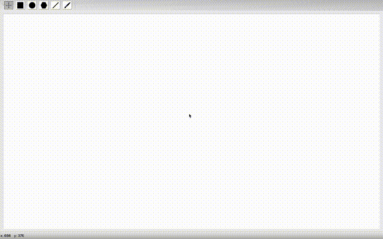
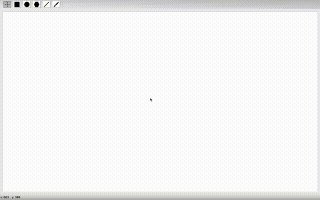
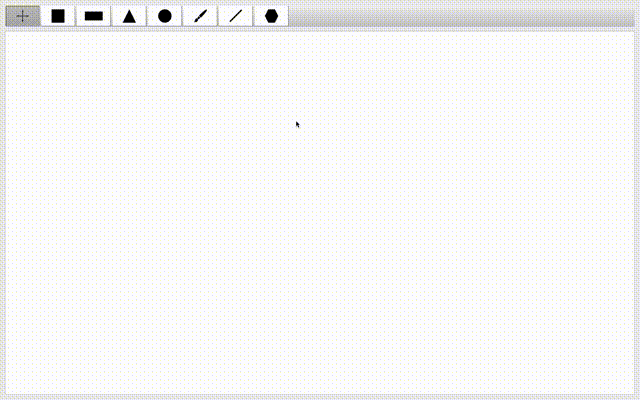
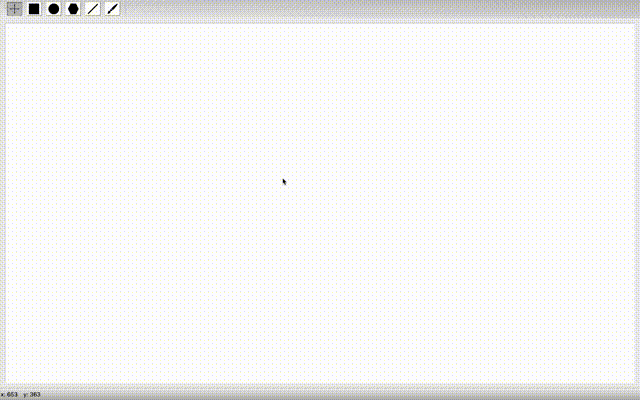
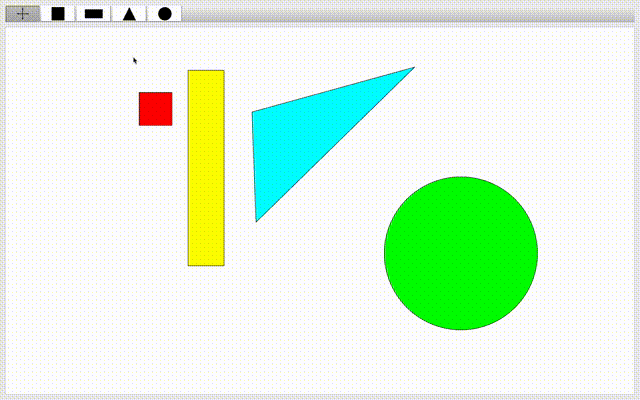
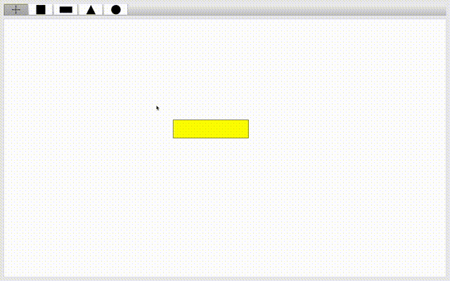
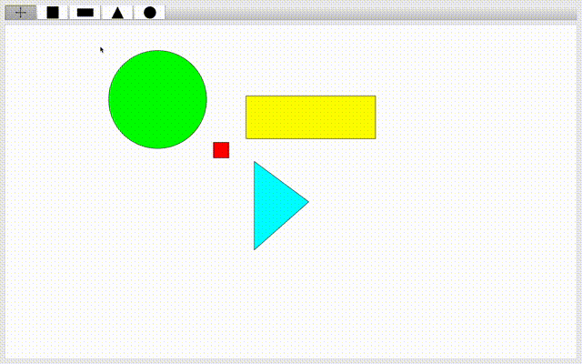
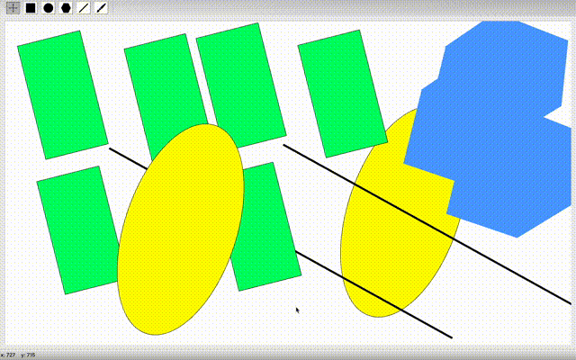

# Графическое приложение Painter с использованием C++ Qt Framework

### Приложение для рисования, создаваемое с целью освоения широкого спектра возможностей фреймворка Qt.

#### На данный момент приложение поддерживает следующий функционал:

- Режим модификации фигур
- Режим создания прямоугольника
- Режим создания окружности
- Режим создания многоугольника
- Режим создания прямых линий
- Режим рисования кистью
- Возможность выбора цвета заливки
- Возможность выбора цвета обводки
- Возможность выбора ширины обводки

#### Правила, определенные для создания геометрических фигур:

- **Прямоугольник**: при нажатии левой кнопки мыши определяется вершина одного из углов прямоугольника, при движении с зажатой левой кнопкой мыши определяется противоположная по диагонали вершина угла прямоугольника. Прямоугольник принимает конечное состояние после отпускания левой кнопки мыши. При зажатии кнопки _"Shift"_ происходит отрисовка квадрата, одной из вершин которого является точка с координатами первого клика левой кнопки мыши, длина стороны квадрата опредяется равной длине меньшего из двух прямых отрезков, образованных от текущего положения курсора до осей X и Y.

  

- **Окружность**: окружность рисуется как вписанная в многоугольник, создаваемый по правилам, описанным выше. Круг отрисовывается по соотвествующим правилам, как вписанный в квадрат при зажатой кнопкой _"Shift"_.

  

- **Многоугольник**: многоугольник создается по координатам, определенным последовательными нажатиями левой кнопки мыши. Последняя координата определяется нажатием правой кнопки мыши. Между кликами отрисовывается отрезок от предыдущих координат нажатия левой кнопки мыши до текущих координат курсора.

  

- **Прямая линия**: при нажатии на левую кнопку мыши фиксируется начальная координата линии. При движении мыши с удерживаемой левой кнопкой отрисовывается линия из двух точек: 1 - начальные координаты клика мыши, 2 - текущие координаты курсора. Линия принимает конечное состояние после отпускания левой кнопки мыши.

  

- **Кисть**: при нажатии на левую кнопку мыши рисуется закругленная точка размером, определенным по умолчанию в настройках - 10px. При движении мыши с зажатой левой кнопкой рисуется линия, которая отрисовывается по координатам пути движения мыши. Толщина линии также определена настройками по умолчанию - 10px.

  

Процесс создания всех фигур отрисовывается динамически.

#### Работа в режиме модификации:

- **Выделение**: в этом режиме фигура выбирается по нажатию левой кнопки мыши внутри фигуры. Выделение фигур снимается по нажатию и отпусканию левой кнопки мыши вне фигур, если координаты нажатия и отпускания совпали. Если после нажатия левой кнопки мыши вне фигуры продолжить движение мыши с зажатой левой кнопкой, то будет рисоваться прямоугольник множественного выделения от координат точки нажатия мыши до текущих координат курсора. После отпускания левой кнопки мыши все фигуры, находящиеся в прямоугольнике или пересекающие его, становятся выделенными. Со всех остальных выделение снимается, если не была нажата кнопка _"Ctrl/Command"_. Если была нажата кнопка _"Ctrl/Command"_, то, находящиеся в прямоугольнике или пересекающие его фигуры, добавляются к уже выделенным фигурам. Если во время одиночного выделения была зажата кнопка _"Ctrl/Command"_, то выделенная фигура добавляется к множеству уже выделенных.

  

- **Перемещение**: если после нажатия левой кнопки мыши внутри одной из выделенных фигур продолжить движение с зажатой кнопкой, то все выделенные фигуры будут перемещаться на расстояние равное вектору координат нажатия левой кнопки мыши и координат текущего положения курсора. Перемещение останавливается при отпускании левой кнопки мыши.

  

- **Вращение**: если после нажатия правой кнопки мыши внутри одной из выделенных фигур продолжить движение с зажатой кнопкой, то фигуры будут вращаться относительно их геометрического центра на угол, образованный отрезками OA и OB, где O - геометрический центр, A - координаты курсора в момент нажатия правой кнопки мыши, B - текущие координаты курсора.

  

- **Клонирование**: нажатие левой кнопки мыши с зажатой кнопкой _"Shift"_ внутри одной из выделенных фигур создает копии всех выделенных фигур (в тех же координатах, что и оригинальные фигуры). Если после совершения копирования начать движение мыши - копии перемещаются согласно правилам перемещения, указанным выше.

  

- **Удаление**: при нажатии клавиши _"D"_ все выбранные фигуры удаляются.

  

## TODO:

- Добавить режим рисования ломаных линий
- Добавить режим нанесения текста
- Добавить список отображения слоёв графической сцены
- Добавить горячие клавиши для режимов приложения
- Добавить сохранение изображений в растровом формате
- Добавить экспорт в svg-формат
- Добавить возможность изменения цвета для созданных фигур
- Добавить возможность редактирования размеров фигур
- Добавить сериализацию/десериализацию графической сцены с помощью Google Protocol Buffers
