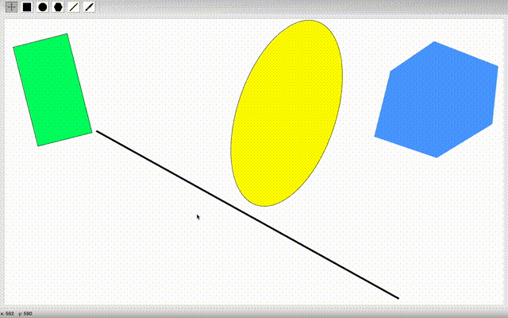

# Графическое приложение Painter с использованием C++ Qt Framework

### Приложение для рисования, создаваемое с целью освоения широкого спектра возможностей фреймворка Qt.

#### На данный момент приложение поддерживает следующий функционал:

- Режим модификации фигур
- Режим создания квадрата
- Режим создания прямоугольника
- Режим создания треугольника
- Режим создания окружности
- Режим рисования кистью
- Режим рисования линий

#### Правила, определенные для создания геометрических фигур:

- **Квадрат**: при нажатии левой кнопки мыши определяется центр квадрата, при движении с зажатой левой кнопкой мыши сторона квадрата определяется расстоянием от центра квадрата до текущей позиции мыши, поделенным надвое. Квадрат принмает конечное состояние после отпускания левой кнопки мыши.

  

- **Прямоугольник**: при нажатии левой кнопки мыши определяется вершина одного из углов прямоугольника, при движении с зажатой левой кнопкой мыши определяется противоположная по диагонали вершина угла прямоугольника. Прямоугольник принмает конечное состояние после отпускания левой кнопки мыши.

  

- **Треугольник**: треугольник создаётся по трём координатам, которые определяются путём последовательного нажатия левой кнопки мыши. После первого нажатия левой кнопки мыши и дальнейшего движения мыши (неважно, с нажатой кнопкой мыши или нет) рисуется отрезок от момента нажатия до текущего положения курсора. Также происходит после второго нажатия, а после третьего нажатия создаётся треугольник.

  

- **Окружность**: при нажатии левой кнопки мыши определяется центр окружности, при движении с зажатой кнопкой мыши радиус окружности равен расстоянию от центра окружности до текущей позиции мыши. Окружность принимает конечное состояние после отпускания левой кнопки мыши.

  

- **Кисть**: при нажатии на левую кнопку мыши рисуется закругленная точка размером, определенным по умолчанию в настройках - 10px. При движении мыши с зажатой левой кнопкой рисуется линия, которая отрисовывается по координатам пути движения мыши. Толщина линии также определена настройками по умолчанию - 10px.

  

- **Линия**: при нажатии на левую кнопку мыши фиксируется начальная координата линии. При движении мыши с удерживаемой левой кнопкой отрисовывается линия из двух точек: 1 - начальные координаты клика мыши, 2 - текущие координаты курсора. Линия принимает конечное состояние после отпускания левой кнопки мыши.

  

Процесс создания всех фигур отрисовывается динамически.

#### Работа в режиме модификации:

- **Выделение**: в этом режиме фигура выбирается по нажатию левой кнопки мыши внутри фигуры. Выделение фигур снимается по нажатию и отпусканию левой кнопки мыши вне фигур, если координаты нажатия и отпускания совпали. Если после нажатия левой кнопки мыши вне фигуры продолжить движение мыши с зажатой левой кнопкой, то будет рисоваться прямоугольник множественного выделения от координат точки нажатия мыши до текущих координат курсора. После отпускания левой кнопки мыши все фигуры, находящиеся в прямоугольнике или пересекающие его, становятся выделенными. Со всех остальных выделение снимается, если не была нажата кнопка _"Ctrl/Command"_. Если была нажата кнопка _"Ctrl/Command"_, то, находящиеся в прямоугольнике или пересекающие его фигуры, добавляются к уже выделенным фигурам. Если во время одиночного выделения была зажата кнопка _"Ctrl/Command"_, то выделенная фигура добавляется к множеству уже выделенных.

  

- **Перемещение**: если после нажатия левой кнопки мыши внутри одной из выделенных фигур продолжить движение с зажатой кнопкой, то все выделенные фигуры будут перемещаться на расстояние равное вектору координат нажатия левой кнопки мыши и координат текущего положения курсора. Перемещение останавливается при отпускании левой кнопки мыши.

  

- **Вращение**: если после нажатия правой кнопки мыши внутри одной из выделенных фигур продолжить движение с зажатой кнопкой, то фигуры будут вращаться относительно их геометрического центра на угол, образованный отрезками OA и OB, где O - геометрический центр, A - координаты курсора в момент нажатия правой кнопки мыши, B - текущие координаты курсора.

  

- **Клонирование**: нажатие левой кнопки мыши с зажатой кнопкой _"Shift"_ внутри одной из выделенных фигур создает копии всех выделенных фигур (в тех же координатах, что и оригинальные фигуры). Если после совершения копирования начать движение мыши - копии перемещаются согласно правилам перемещения, указанным выше.

  

- **Удаление**: при нажатии клавиши _"D"_ все выбранные фигуры удаляются.

  

## TODO:

- Добавить режим рисования кистью ✅
- Добавить режим рисования многоугольников
- Добавить режим рисования линий ✅
- Добавить режим нанесения текста
- Добавить возможность выбора цвета для создаваемых фигур
- Добавить возможность изменения цвета для созданных фигур
- Добавить сериализацию/десериализацию графической сцены с помощью Google Protocol Buffers
